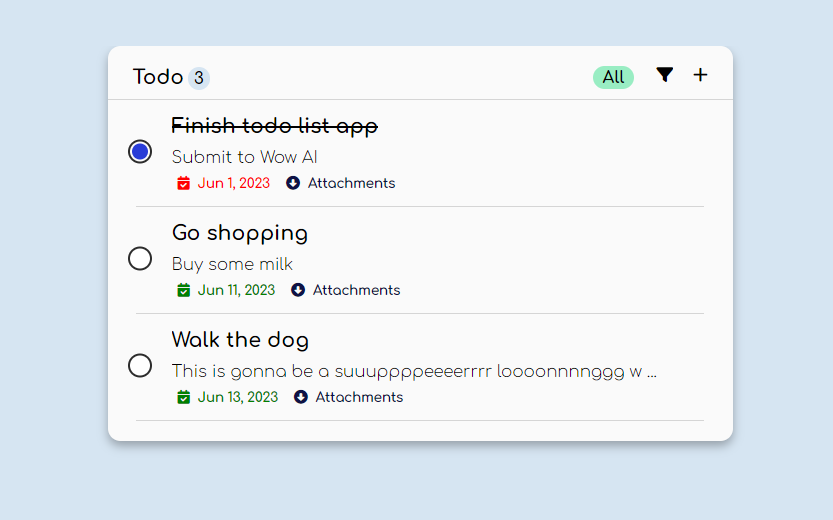

# :heavy_check_mark:Todo List
A simple todo list application made with ReactJS

## :thought_balloon:How to run?
> Get the code
```
$ git clone https://github.com/hieptth/to-do-list.git
$ cd to-do-list
```
> Start the app in VSCode (optional)
```
$ code .        # This step is optional, you may choose other editor.
$ npm i         # Install the dependencies
$ npm run dev   # Start the developer build
```
Visit the **link** provided in the terminal. The app should be up & running.



## :nut_and_bolt:Code-based Structure
The project has a super simple structure, represented as below:
```
< PROJECT ROOT >
|
│--- .eslintrc.cjs
│--- .gitignore
│--- index.html
│--- main.css
│--- package-lock.json
│--- package.json
│--- README.md
│--- tsconfig.json
│--- tsconfig.node.json
│--- vite.config.ts
│ 
├───public
│   │--- site.webmanifest
│   │--- 
│   └───assets
│       | --- *.png
│
└───src
    │--- App.css
    │--- App.tsx
    │--- main.tsx
    │--- vite-env.d.ts
    │
    ├───assets
    └───components
        | --- AddCard.tsx
        | --- Card.tsx
        | --- CardDetail.tsx
        | --- TodoWrapper.tsx
```

## :soon:Deployment
You can check out the deployed product via the [link](https://hieptth-to-do-list.netlify.app/).